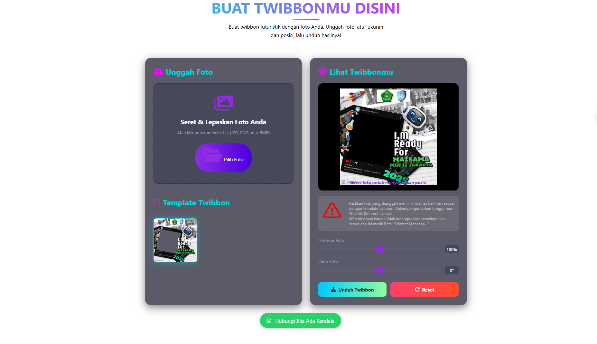

# 🔐 TWIBBON MATSAMA MTS

Web app **Twibbon Generator** dengan desain **moderen putih dan responsif**.  
Dibuat untuk memberikan mempermudah siswa/i MI dalam membuat twibbon dalam melaksanakan MATSAMA-nya, tanpa **Iklan** dan **Wathermark**.

## ✨ Fitur
- 🎨 **UI Futuristik** dengan kombinasi warna putih dan abu-abu yang menawan
- 📱 **Responsif** – mendukung tampilan di desktop, tablet, dan mobile  
- 🔑 **Konten** dengan hanya input foto dan atur posisi sehingga mendapatkan hasil twibbon kualitas Tinggi  
- 🚀 **Animasi Halus** Tombol, animasi & elemen interaktif  
- 🌐 **Tampilan Split Layout**: Dengan tema yang interaktif untuk usia usia anak MI/SD memberikan kenyamanan dalam penggunaan

## 📸 Preview


## 🛠️ Teknologi yang Digunakan
- **HTML5** – struktur halaman
- **CSS3 (Flexbox/Grid)** – layout modern & responsif
- **JavaScript** – Interaktif dan fungsi
- **Google Fonts** – tipografi clean dan modern

## ⚡ Cara Menggunakan
1. Selamat Mencoba  
   ```bash
   https://abdussalam090207.github.io/twibbonku/
